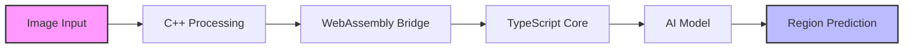

# 🌍 Giovani AI - GeoGuessr Assistant

<div align="center">


</div>

---

## 🎯 Overview

Giovani AI is an advanced artificial intelligence assistant designed to help predict locations in the GeoGuessr game. Built with TypeScript, C++, and TensorFlow.js, this AI leverages high-performance native code and machine learning to analyze images and predict locations based on detected visual features.

## ✨ Features

<div align="center">

🚀 **High-Performance** | 🧠 **Deep Learning** | 🌐 **Multi-Region** | 🔒 **Type-Safe**
:---: | :---: | :---: | :---:
C++ & WebAssembly powered | Advanced CNN Model | Global Coverage | TypeScript & Rust

</div>

### Key Capabilities
- 🖥️ High-performance image processing using C++ native code
- 🤖 Location prediction based on deep learning analysis
- 🧮 Advanced CNN (Convolutional Neural Network) architecture
- 🗺️ Support for 6 main regions:
  - North America
  - South America
  - Europe
  - Asia
  - Africa
  - Oceania
- 📝 Type-safe implementation
- ⚡ WebAssembly integration for optimal performance

## 🏗️ Architecture



## 📂 Project Structure

```
giovani-ai/
├── 📱 src/           # TypeScript source code
│   ├── cpp-bridge.ts    # C++ interface
│   ├── rust-bridge.ts   # Rust/WASM interface
│   └── function.ts      # Core AI functions
├── 🔧 cpp/           # C++ native code
├── ⚙️ rust/          # Rust WebAssembly code
├── 📊 dist/          # Compiled output
└── 🧪 tests/         # Test suites
```

## 🚀 Performance

Our hybrid architecture ensures optimal performance through:

| Component | Role | Benefit |
|-----------|------|---------|
| 🔥 C++ | Image Processing | Ultra-fast native performance |
| ⚡ WebAssembly | Cross-platform Code | Near-native speed everywhere |
| 📊 TypeScript | Application Logic | Type-safe, maintainable code |

## 🤝 Contributing

<div align="center">

We welcome contributions! Whether it's bug fixes, features, or documentation improvements.

[](http://makeapullrequest.com)

</div>

## 📄 License

This project is licensed under the MIT License - see the LICENSE file for details.

---

<div align="center">

**Made with ❤️ by the Giovani AI Team**

[Report Bug](https://github.com/southclown/Giovani-AI/issues) · [Request Feature](https://github.com/southclown/Giovani-AI/issues)

</div>
